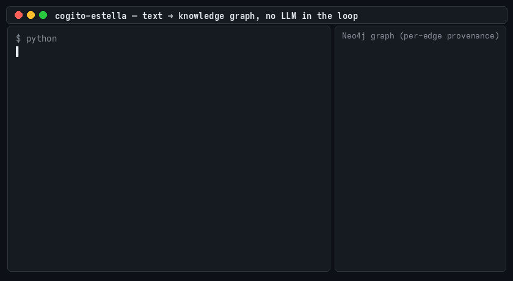

# Cogito Estella (v0.16.0)

Knowledge-graph memory for agents. A local model turns documents into `subject relation
object` facts in one non-autoregressive pass (no LLM tokens), and the `cogito-mcp` server
answers questions from that graph and the sentences behind it, so an agent reads a few
hundred tokens instead of a whole document.



## Install and connect

```bash
pip install "cogito-estella[mcp]"        # add [pdf] for PDF input
```

Client configuration (Claude Code `.mcp.json`, Cursor, any MCP client):

```json
{"mcpServers": {"cogito": {"command": "cogito-mcp", "args": ["--dir", ".cogito"]}}}
```

On first run the server downloads the spaCy model and the default weights from
[Hugging Face](https://huggingface.co/DeliVali/cogito-estella): Meta's frozen M2M-100 418M
encoder (MIT, ~1.9 GB) under a learned pooling, and three decoder heads (Apache-2.0).
Python 3.12; a GPU is optional (`--device cpu`). The graph lives in `.cogito/graph.json`;
add that directory to `.gitignore`.

## Tools

- `ingest(path_or_text)` — a file, a directory (txt/md/html/pdf) or raw text. Documents
  are deduplicated by content hash and replaced when they change.
- `ask(question, budget=600, use_dense=False)` — start here. The graph facts for the
  entities in the question, a `--` line, then the source sentences that answer it, within
  `budget` tokens (`use_sonar` is the older name of the flag). Sentences are shortlisted by IDF and ordered by a learned relevance
  scorer; `use_dense=True` ranks them by encoder cosine instead.
- `query(entity, hops, limit)`, `provenance(edge_ids)`, `search(term)`, `entities(prefix)`
  and `stats()` go deeper when one `ask` is not enough. Facts listed under
  `~ class-only, verify with provenance:` carry only a coarse relation label.

```
entities: blt, layer · scorer=learned
blt encode byte #12
--
2412.09871.txt s112: "We use SwiGLU activation in the feed-forward layers, as in Llama 3."
```

Flags: `--encoder sonar` for the SONAR-space heads (research only: `pip install
"cogito-estella[sonar]"`, CC-BY-NC 4.0 at runtime); `--checkpoint`, `--vocab` and `--pool`
for local weights; `--device`; `--no-download`. `COGITO_ASK_SCORER=lexical` keeps the
plain IDF order.

## Measured

50 questions over five arXiv papers, answered by Claude Code headless (Haiku) under the
same rules in every branch, judged blind to the branch, with the Claude Code prefix
calibrated the same day:

| branch | accuracy | raw input tokens / question | net tokens / question |
| :--- | :--- | :--- | :--- |
| whole paper in the prompt | 1.00 | 38,231 | 12,810 |
| native `Read`/`Grep` on the file | 0.98 | 89,493 | 4,753 |
| one `ask` reply (600-token budget) | 0.78 | 26,126 | 613 |

Raw tokens are what the API bills before caching, measured end to end; the ~25k-token
Claude Code prefix dominates every branch. Net tokens subtract that calibrated prefix and
are an estimate. One `ask` reply answers 78 % of the questions (abstaining on 16 %) at
1.46× fewer raw tokens and about 21× fewer net tokens than pasting the paper; the
`Read`/`Grep` agent is accurate but costs 2.3× the raw tokens of pasting the paper.

Extraction quality: the default three-head ensemble reaches Triple F1 **0.852** on
held-out sentences whose entity/relation combinations never appeared in training; on
5,000 sentences held out under both protocols it scores 0.819 against 0.730 for the
SONAR-space ensemble.

## Python

```python
from cogito_estella.integrations.llamaindex_connector import CogitoGraphExtractor
from cogito_estella.mcp.weights import resolve

w = resolve(None, None)                                  # the default assets, downloaded once
ex = CogitoGraphExtractor([str(c) for c in w.checkpoints], str(w.vocab), pool_path=w.pool,
                          threshold=w.operating_point[0], adj_threshold=w.operating_point[1])
ex.extract("The committee approved the new budget.")    # [(subject, relation, object), ...]
```

`extract_with_literals` keeps exact literals (IDs, hashes, amounts) verbatim and
`literals_to_neo4j` stores them with provenance; `to_neo4j` writes triples into Neo4j. Call
`ensure_schema(driver)` once per database before concurrent writers: its uniqueness
constraints make parallel `MERGE`s deterministic, and they cannot be created while the
database still holds duplicate nodes. `cogito_estella.graph_summary.GraphSummarizer`
writes community summaries over the triples and flags (`accepted=False`) the ones that
mention entities absent from their cluster.

## How it works

Each head is a compact non-autoregressive decoder (38M parameters) on a frozen sentence
encoder: the candidate entities found in the sentence act as queries over its vector, and
existence plus a 76-relation adjacency come out in one forward pass (about 0.01 ms per
sentence on an RTX 5070). Relations are named from the sentence's dependency syntax when a
pattern is recognized; otherwise the fact keeps the class label only. Every edge points
back to its source sentence and character spans.

## Weights and licensing

| Encoder | Assets on the Hub | Licence |
| :--- | :--- | :--- |
| `m2m100-pool` (default) | `m2m100-pool/cogito-prose-ontology-m2mpool{,-s2,-s3}.safetensors`, `pool.safetensors`, `vocab-onto-m2mpool.json`; manifest `encoders.json` | heads and pooling Apache-2.0; M2M-100 encoder MIT |
| `sonar` | `cogito-prose-ontology{,-s2,-s3}.pt`, `vocab-onto.json` | heads Apache-2.0; the SONAR encoder they need is CC-BY-NC 4.0 |

Every checkpoint carries its encoder, revision, width and normalization; a checkpoint
decoded in the wrong space stops the server, and a startup canary re-checks the encoder
against shipped reference cosines. Earlier research heads (tool calls, code, open-vocab
prose) remain on the Hub and are described in its model card.

## Development

```bash
uv sync --all-extras
uv run python -m spacy download en_core_web_sm
uv run pytest tests/
```

573 tests with every extra installed; modules that need the `[sonar]` extra and the tests
that load a real encoder on CUDA skip themselves without them. Package layout:
`model/` (decoder heads), `encoders/` (encoder contract, adapters, pooling, canary),
`mcp/` (store, readers, scorers, server), `integrations/` (the extractor). Training data,
experiments and logs are untracked; see `CHANGELOG.md` for the version history.

## License

Apache License 2.0 (see `LICENSE`). Weight licensing is described above.
