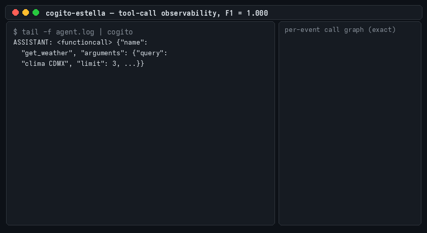
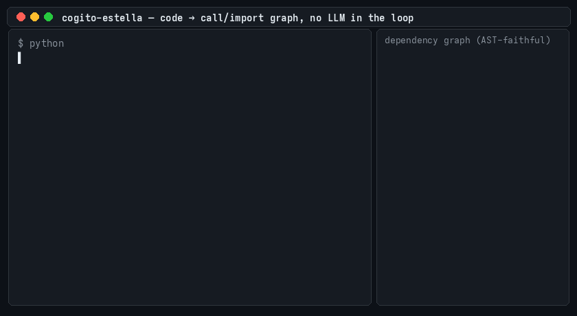

# Cogito Estella: Latent Graph Engine (v0.16.0)

Non-autoregressive inference backend that decodes SONAR (Meta) semantic embeddings
directly into knowledge graphs, bypassing token-based text decoding entirely.
Mapped, trained, and validated end-to-end on a single RTX 5070 (12 GB).


## Why

GraphRAG over millions of documents with autoregressive LLMs is budget-prohibitive:
per-token decoding, per-token API pricing, and malformed-output retry loops. Cogito
Estella emits the full adjacency structure in one dense forward pass — structurally
valid by construction, at consumer-hardware cost.

---

## Inference Architecture

The engine attaches compact non-autoregressive decoder heads (5.8M–45M parameters)
to Meta's frozen multilingual latent space. Input: a concept embedding
$e \in \mathbb{R}^{1024}$ (sentence segmented with SaT, projected by SONAR). No time
dimension — a single pass emits the complete graph.

```
e ∈ ℝ^1024
  │  deep trunk (optional): 1–3 × [Linear → GELU → LayerNorm]
  ▼
N ∈ ℝ^{K × d}          # K node slots (fixed grid) or C candidates (elastic)
  ├─ existence   s ∈ ℝ^K            = σ(W_s · N)
  ├─ labels      ℓ ∈ ℝ^{K × V}      = W_ℓ · N          (open-vocab head)
  └─ adjacency   A ∈ ℝ^{R × K × K}  = N_i^T W_r N_j    (low-rank: W_r = U_r V_r^T)
```

Two production head families:

* **`GraphDecoder`** (open-vocab): fixed K-slot grid, V-way label softmax per slot,
  bilinear adjacency. Optional deep GELU/LayerNorm trunk (`trunk_layers`).
* **`CandidateGraphDecoder`** (entity-conditioned): caller supplies candidate
  entities (text scan and/or graph-memory nodes); candidates act as cross-attention
  queries over learned concept views via `nn.Embedding` lookup. Output space is
  restricted by construction — zero vocabulary leakage. Elastic COO adjacency sized
  to the candidate list; low-rank bilinear relations (rank 64); calibrated decode
  with a force-top1 recall floor.

Training objective — structural loss, no sampling, no teacher forcing:
$\mathcal{L} = \mathrm{BCE}(\hat{s}, s) + \mathrm{CE}_{\text{masked}}(\hat{\ell}, \ell) + \mathrm{BCE}(\hat{A}, A)$.

---

## Metrics & Experimental Benchmark Summary

Held-out evaluation, split **by combination** (an entity/relation combination never
seen in training, eliminating duplicate leakage). Prose numbers are validated on
virgin slices of a 119,911-sample held-out pool that took no part in any model,
threshold, or ensemble selection; structured modalities use their own
combination-held splits (tool-calls: 12,147 held-out concepts spanning 240 unseen
combinations).

| Modality | Triple F1 | Recipe |
| :--- | :--- | :--- |
| Tool-calling / API control | **1.000** | 24.3M `GraphDecoder`, deterministic decode, zero-leakage combination split |
| Source code structure (Python AST oracle) | **0.781** | LoRA-adapted SONAR (r=32) + decoder, fixed-threshold decode |
| Entity-conditioned prose (restricted candidates) | **0.827** | 5-seed `CandidateGraphDecoder` ensemble, cross-attention entity conditioning, calibrated decode + force-top1 |
| Open-vocab prose (fallback, no candidates) | **0.6514** | 3-seed `GraphDecoder` ensemble + trained cascade as empty-decode fallback |

Oracles: exact-by-construction JSON (tool-calls), native Python `ast` parser (code),
deterministic dependency-parse SVO (prose). Adjacency thresholding ships three
strategies (`fixed`, `otsu`, `noise_floor`); the sparsity-prior `noise_floor`
dominates variance-based Otsu on sparse graphs (8/8 vs 3/8 stress scenarios).

<details>
<summary><b>Demo: tool-call observability (F1 = 1.000)</b> — raw agent stream → exact per-event call graphs</summary>


</details>

<details>
<summary><b>Demo: code → call/import graph (F1 = 0.781)</b> — one line can yield multiple edges</summary>


</details>

## Core Latency & Compute Footprint

Measured on consumer silicon (RTX 5070, 12 GB, CUDA 12.8), batch 1024:

* Non-autoregressive forward pass: **0.013 ms per sentence concept**
  (single `CandidateGraphDecoder`; 0.052 ms for the 24.3M open-vocab production
  config; ~0.06 ms for the 5-model prose ensemble). 269–1074× faster wall-clock
  than autoregressive text decoding of the same content.
* Context state: **336 KB per active prefill thread** vs. 2.1 GB KV-cache on a
  standard 7B autoregressive model at 4k context — a **6,400× reduction**.
* FLOP reduction: **36×** against a matched char-level token baseline (dense
  structural blocks) up to **2,881×** for exact string literals via the parallel
  char-grid mapping (digits/characters as nodes, no copy loop).
* Encode throughput (SaT + sanitization + SONAR): ~273 concepts/s; storage density
  ~2.19 KB/concept (fp16).

## Production Integration Patterns

* **GraphRAG ingestion pipelines** — vector-to-knowledge-graph indexing without
  per-token commercial API calls; graphs land as COO triples ready for `MERGE`
  into any property-graph store, with per-edge provenance.
* **Non-autoregressive tool dispatchers** — raw text streams decoded into typed
  call structures in one pass; output is structurally valid by construction
  (no JSON repair, no syntax-breaking retries).
* **Incremental AST repository tracking** — hook file-save events to re-encode
  changed units and merge live call/import dependency sub-graphs into memory.
* **Multilingual agent memory shards** — chat history compressed into
  language-agnostic 1024-d concepts (SONAR, 200 languages) and decoded to a
  queryable graph; entity-conditioning accepts the agent's existing graph nodes
  as candidates.

## MCP Server (`cogito-mcp`)

Give any MCP client a persistent knowledge-graph memory over your documents. Ingest once
(zero LLM tokens: the local model does the extraction), then answer questions from the
graph and its sentences instead of reading files.

```bash
pip install "cogito-estella[mcp]"          # add [pdf] for PDF input
python -m spacy download en_core_web_sm    # done automatically on first run unless --no-download
```

The server runs on the **`m2m100-pool`** encoder by default: Meta's frozen M2M-100 418M
encoder (MIT) under a learned attention pooling trained here. Pooling and decoder heads
are Apache-2.0 and download from Hugging Face on first run — no non-commercial term
anywhere in the default path. The SONAR encoder stays available for research
(`pip install "cogito-estella[sonar]"`, `--encoder sonar`) and keeps its CC-BY-NC 4.0
terms at runtime; SONAR-era checkpoints without encoder metadata still resolve to SONAR,
so 0.15.0 setups keep working unchanged.

Client configuration (Claude Code `.mcp.json`, Cursor, etc.):

```json
{"mcpServers": {"cogito": {"command": "cogito-mcp", "args": ["--dir", ".cogito"]}}}
```

Tools: `ask(question, budget, use_sonar)` — the default route from a question to an answer —
plus `ingest(path_or_text)` (file, directory of txt/md/html/pdf, or raw text; documents
are deduplicated by content hash and replaced when they change), `query(entity, hops,
limit)`, `provenance(edge_ids)`, `search(term)`, `entities(prefix)`, `stats()`.

`ask` returns the graph facts for the entities it recognizes in the question, then a `--`
line, then the source sentences that answer it, capped at `budget` tokens (default 600,
40 % facts / 60 % sentences). Lexical IDF is the primary ranking engine; `use_sonar=True`
(off by default) ranks the sentence block by SONAR cosine instead, and falls back to
lexical with a note when the graph carries no embeddings. The two scores are never
merged:

```
entities: blt, layer · scorer=lexical
blt encode byte #12
--
2412.09871.txt s112: "We use SwiGLU activation in the feed-forward layers, as in Llama 3."
```

Use `query`, `provenance` and `search` to go deeper when one `ask` is not enough. `query`
prints facts as `subject relation object #edge_ids`. Facts whose relation was read
from the sentence's syntax come first; the line `~ class-only, verify with provenance:`
introduces facts that only carry a coarse class label — check those with `provenance`
before relying on them. The graph lives in `<dir>/graph.json` (sentence embeddings in
`<dir>/graph.emb.npz`) and survives restarts.

Weights: the manifest `encoders.json` in the Hugging Face repository maps each encoder to
its published assets, and the default encoder resolves to the m2m100-pool ontology
ensemble (`cogito-prose-ontology-m2mpool{,-s2,-s3}.safetensors` + `vocab-onto-m2mpool.json`
+ `pool.safetensors`, subfolder `m2m100-pool`). Pass `--encoder sonar` for the SONAR-era
ensemble at the repository root, `--checkpoint` (repeatable) and `--vocab` to use local
files, `--pool` for local pooling weights (env `COGITO_POOL`), `--device` to force
`cuda`/`cpu` (default: auto-detect), `--no-download` to fail fast offline. Checkpoints
carry their encoder, width and normalization; a checkpoint decoded in the wrong semantic
space stops the server instead of emitting triples, and a startup canary re-checks the
encoder itself against shipped reference cosines.

The graph directory (`.cogito/` by default) holds your ingested documents; add it to
your project's `.gitignore` rather than committing it.

## Use Cases

* **Agent long-term memory ("second brain")** — every message, note, or document an
  agent touches becomes graph triples in a property store (Neo4j, SQLite); sessions
  end, knowledge persists and stays queryable.
* **GraphRAG grounding** — answer-time retrieval over structured facts instead of
  (or alongside) vector similarity; the LLM cites edges that exist, reducing
  hallucinated recall.
* **Tool-call observability** — agent traces decoded at F1 1.000 make "which tools
  touched service X" an exact graph query, at near-zero compute.
* **Codebase intelligence** — call/import dependency graphs over whole repositories
  at a cost where re-indexing on every save is affordable.
* **Multilingual knowledge consolidation** — SONAR's language-agnostic space lets
  documents in 200 languages land in one shared graph.
* **Log & trace mining** — high-volume streams (support tickets, incident reports,
  transcripts) structured continuously on one consumer GPU, where per-token LLM
  extraction is cost-prohibitive.
* **Compliance & provenance KBs** — every edge carries source metadata; audits
  answer "where does this fact come from" by construction.

## Global Summarization (`GraphSummarizer`)

GraphRAG-style sensemaking where the expensive stage (per-chunk extraction) costs zero
LLM tokens; the LLM only writes per-community summaries (~10 calls per book instead of
~600), with automatic entity-grounding rejection of unverifiable output:

```python
from cogito_estella.graph_summary import GraphSummarizer

gs = GraphSummarizer(llm_fn=my_llm)          # any callable: prompt -> str
report = gs.summarize(triples, top_k=8)      # triples from the extractor
for c in report:
    print(c["accepted"], c["grounding"], c["top_entities"][:5], c["summary"])
```

Validated on a full novel: coherent thematic clusters at ~155x fewer LLM tokens than
per-chunk extraction pipelines; low-cohesion clusters are gated out and summaries that
mention entities absent from their cluster are rejected automatically.

## Pretrained Weights & Quickstart

Champion checkpoints ship via [GitHub Releases](../../releases) and
[Hugging Face (`DeliVali/cogito-estella`)](https://huggingface.co/DeliVali/cogito-estella):

| Asset | Modality | F1 |
| :--- | :--- | :--- |
| `cogito-toolcalls-graphdecoder.pt` | tool-calls | 1.000 |
| `cogito-code-lora-adapters.pt` | code (LoRA + decoder) | 0.781 |
| `cogito-prose-candidates-{ft,cal,base,s2,s3}.pt` | entity-conditioned prose (5-seed ensemble) | 0.827 |
| `cogito-prose-openvocab{,-s4,-s5}.pt` + `cogito-prose-cascade-fallback.pt` | open-vocab prose stack | 0.6514 |
| `vocab-prose.json` | entity/relation vocabulary (20k/60) | — |
| `cogito-prose-ontology{,-s2,-s3}.pt` + `vocab-onto.json` | ontology ensemble ×3, 76 relations (SONAR) | 0.796 @ 91 % coverage |
| `m2m100-pool/cogito-prose-ontology-m2mpool{,-s2,-s3}.safetensors` + `vocab-onto-m2mpool.json` + `pool.safetensors` | ontology ensemble ×3, 76 relations (M2M-100 + learned pooling) | 0.784 @ 91 % coverage — default for `cogito-mcp`, fully permissive |

```bash
pip install "cogito-estella[sonar]"     # or: uv sync (from a clone)
# download cogito-prose-candidates-ft.pt + vocab-prose.json next to quickstart.py
python quickstart.py
```

`quickstart.py` encodes two raw sentences and prints their decoded triples in one
non-autoregressive pass.

**Concurrent ingestion**: call `CogitoGraphExtractor.ensure_schema(driver)` once per
database before parallel writers — it creates idempotent uniqueness constraints that
make concurrent `MERGE`s deterministic (without them, simultaneous ingestion can race
and duplicate nodes). Migrating a pre-existing database: deduplicate first; constraint
creation fails on existing duplicates. Debugging: `extract(..., return_scores=True)`
returns every candidate's existence probability and every edge's confidence, with
forced floor edges flagged.

**Exact literals** (phones, hashes, IDs, precise amounts) never round-trip through the
embedding: `extract_with_literals` detects them deterministically in the source text and
`literals_to_neo4j` stores them verbatim with provenance — character-exact recovery by
query, guaranteed by copying rather than decoding.

**Weight licensing:** all from-scratch decoder heads (GraphDecoder,
CandidateGraphDecoder, trunks, ensembles) and the learned attention pooling are
Apache-2.0; the `m2m100-pool` encoder they run on is Meta's M2M-100 418M, MIT. The
SONAR-space assets (the SONAR encoder itself, the SONAR-era ensembles decoded in its
space, and the code-modality LoRA adapters that modify it) inherit SONAR's CC-BY-NC 4.0
non-commercial terms.

---

## The Map of Literals (Open-Vocab Handling)

Continuous embeddings lose exact values (measured: MAE 36, 1.5% exact on held-out
integers via linear probe). The ceiling breaks at the data level, not the model:

* **Integers:** digits-as-nodes + atomic spacing (`"400"` → `"4 0 0"`): **98.3%**
  exact on unseen values.
* **Short strings (≤4 chars):** characters-as-nodes: **89.9%** exact, open vocab.
* **Long arbitrary strings:** hybrid copy channel (the only autoregressive path).

## Core Structure (`src/cogito_estella/`)

```
src/cogito_estella/
  model/graph_decoder.py       # non-AR GraphDecoder + deep trunk + decode strategies
  model/candidate_decoder.py   # entity-conditioned head: cross-attention, COO, force-top1
  model/transformer.py         # ConceptTransformer (RoPE, RMSNorm, SwiGLU)
  model/token_baseline.py      # matched-FLOP token baseline
  model/sonar_loss.py          # CE propagated through the frozen SONAR decoder
  model/train_graph.py         # resumable training loop
  sonar_codec.py               # SONAR encode/decode, OOM-resilient
  segmenter.py                 # SaT multilingual segmentation
  multilingual_factory.py      # canonicalized ingestion from open sources
  preprocess.py                # sanitization + atomic spacing (script-gated)
  graph_target.py              # target-graph construction
  graph_metrics.py             # Triple F1, GED proxy, tool-call F1
  compute.py                   # FLOP/bandwidth accounting, roofline
```

Training data, experiment scaffolding, and logs are untracked; the unit-test suite
ships with the repository — **427 tests**, fully reproducible offline:

```bash
uv sync
uv run pytest tests/
```

Requires Python 3.12; SONAR/SaT weights download on first use.

## License

Distributed under the **Apache License 2.0**. See the `LICENSE` file for details on
relational-patent protection and commercial use.
